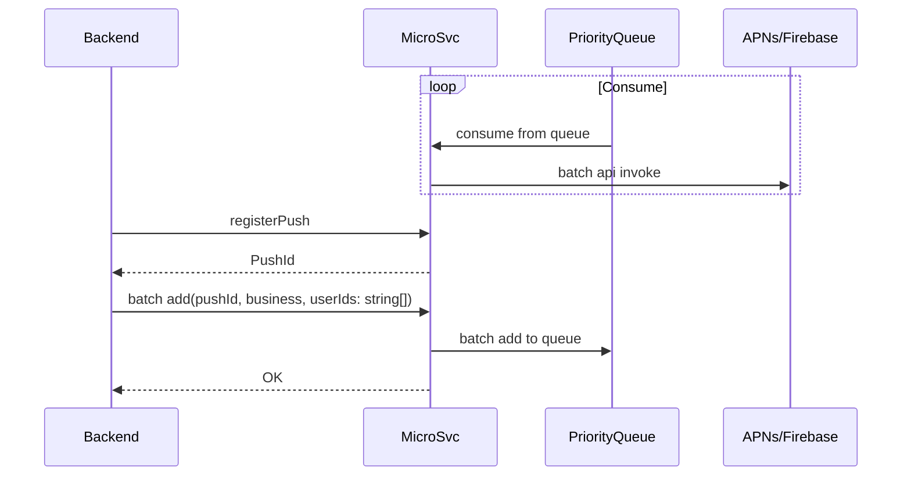

Open source diagram website

https://mermaid.live/edit

```mermaid
sequenceDiagram
participant Backend
participant MicroSvc
participant PriorityQueue
participant APNs/Firebase
loop Consume
    PriorityQueue->>MicroSvc: consume from queue
    MicroSvc->>APNs/Firebase: batch api invoke
end
Backend->>MicroSvc: registerPush
MicroSvc-->>Backend: PushId
Backend->>MicroSvc: batch add(pushId, business, userIds: string[])
MicroSvc->>PriorityQueue: batch add to queue
MicroSvc-->>Backend: OK
```
